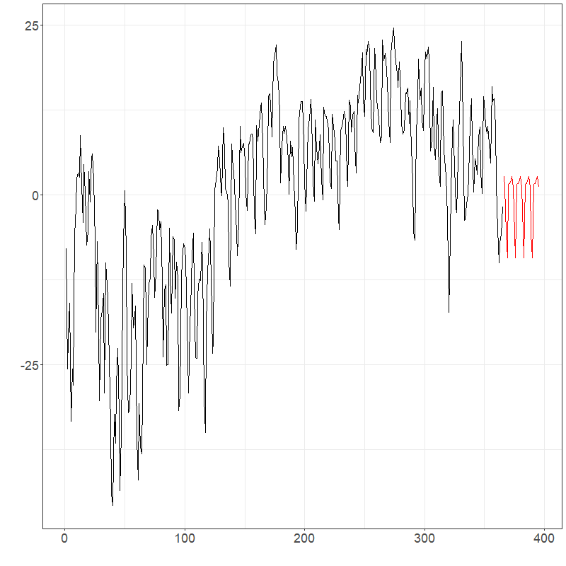
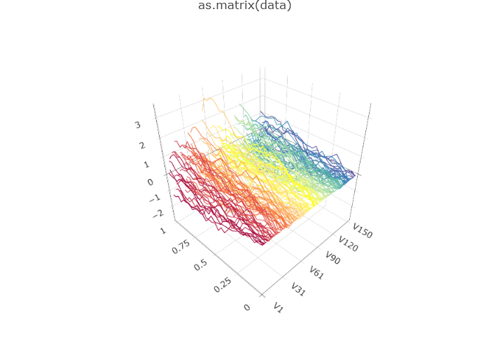

<!--  output: pdf_document ; tinytex::install_tinytex()
https://stackoverflow.com/questions/7653483/github-relative-link-in-markdown-file
-->
```{r, include = FALSE}
knitr::opts_chunk$set(
  collapse = TRUE,
  comment = "#>"
)
```

# Functional Time Series Basics {#ch1}

## Prepatory Information

The package is available on [CRAN](https://cran.r-project.org/web/packages/fChange/index.html). Alternatively, the code can also be installed from GitHub as:
```{r,eval=FALSE}
devtools::install_github("https://github.com/jrvanderdoes/fChange.git@main")
library(fChange)
```


The data for the included exercises can be downloaded using the following code:
```{r,eval=FALSE}
urlfile <- paste0(
  "https://raw.githubusercontent.com/jrvanderdoes/fChange",
  "/main/vignettes/articles/german_data.csv"
)
data <- utils::read.csv(urlfile)
```

The slides can be downloaded [here](https://raw.githubusercontent.com/jrvanderdoes/fChange/main/vignettes/articles/SSC_Short_Course.pdf) and a pdf of this document
can be downloaded [here](https://raw.githubusercontent.com/jrvanderdoes/fChange/main/vignettes/articles/SSC_Short_Course_markdown.pdf).


## Introduction

In ***Time Series Analysis***, one considers a sequence of data observed
over time. Such data can be denoted $X_1,...,X_T$, where $X_i$ is the
data observed at time $i$, and $T$ describes the number of time points
at which data has been obtained, also referred to as the "length\" of
the time series. An example of a scalar, or real-valued, time series of
length $T=504$ is shown in the figure below. This depicts electricity spot prices in Spain
obtained each hour in Euro's per Megawatt/hour during a three week
period in late spring of 2024. The ultimate goal of time series analysis
is to try and make inferences about the process that generated the data.
If we understand how a time series evolves, we can, for example,
forecast it as well as describe how much variability there might be in
future values. The time series shown in the figure below exhibits
apparent daily and weekly "seasonality\" or "periodicity\", which we
might expect in future data.

{width="5in"}
<!-- # ```{r, eval=FALSE} -->
<!-- # plot(as.vector(electricity$data)[7+1:(24*7*3)]) -->
<!-- # ``` -->

Many modern time series arise from observing a nearly continuous time
process at a high frequency. Figure
[1.2](#Fig-spot4){reference-type="ref" reference="Fig-spot4"} shows one
year's, rather than three weeks, worth of hourly electricity spot prices
in Spain from the year 2024 $(T=8736)$. There are evidently some
patterns in the data, although they are somewhat difficult to see given
the high frequency of the data -- it is even difficult to see the
expected daily and weekly periodicity in the time series.

{#Fig-spot4 width="5in"}
```{r, eval=FALSE}
plot(as.vector(electricity$data))
```

An alternative way to view such data is as what we will call a
"functional time series\" (FTS). One might imagine here that each data
point $X_t$ is an observation from an underlying "price process\"
$\{P(t), \; t\ge 0\}$, where $t$ is time in hours starting from January
1, 2024, and $P(t)$ is the spot price at time $t$. Since the price
undergoes daily periodicity, it seems natural to segment the price
process into "daily price functions\" or "daily prices curves\"
$$X_i(t) = P( (i-1)\times 24 + t), \quad i\in \{1,...,365\}, \quad t \in [0,24].$$

Of course we are not able to observe $X_i(t)$ at all points
$t\in [0,24]$. With hourly data as in Figure
[1.2](#Fig-spot4){reference-type="ref" reference="Fig-spot4"}, we
observe 24 data points for each daily function. Nonetheless, thinking of
these data as being "functional\" has some benefits. For instance, we
might linearly interpolate the observed data to create full "daily price
curves\", and plot them sequentially as an alternative visualization of
the data (see below). Such visualizations are shown below. There we
see not only pronounced daily seasonality, but also we observe more
easily weekly periodicity as well as some overall trends and changes in
variability throughout the year.

{width="5in"}
```{r, eval=FALSE}
electricity$labels <- format(as.Date(electricity$labels, "%Y-%m-%d"), "%b")
plot(electricity, type = "fast")
```

{width="5in"}
```{r, eval=FALSE}
plot(electricity,
  plot_title = NULL,
  eye = list(x = -0.5, y = -1.5, z = 0.5),
  aspectratio = list(x = 1, y = 0.6, z = 0.6)
)
```

Such functional time series arise in many different settings. Figure
[1.5](#Fig-sp){reference-type="ref" reference="Fig-sp"} shows a
functional time series constructed from one minute resolution intraday
prices of an S&P500 Exchange Traded Fund and linear interpolation from
the years 2019 to 2023 ($T\approx1250$). Here each curve is constructed
from 390 observations and linear interpolation. Other examples include
pollution in a city (Figure [1.6](#fig:pollution){reference-type="ref"
reference="fig:pollution"}) and (log) mortality rates as a function of
age in France (Figure [1.7](#fig:fmortality){reference-type="ref"
reference="fig:fmortality"}).

{#Fig-sp width="5in"}
```{r, eval=FALSE}
plot(SPYUS500)
```

{#fig:pollution width="5in"}
```{r, eval=FALSE}
urlfile1 <- paste0(
  "https://raw.githubusercontent.com/jrvanderdoes/fChange",
  "/main/vignettes/articles/pollution.txt"
)
city <- utils::read.csv(urlfile1, header = TRUE, sep = ",")$x

city_dfts <- dfts(matrix(as.numeric(city), nrow = 48),
  labels = paste("Day", 1:(length(city) / 48)),
  season = 7
)

plot(city_dfts)
```


The benefits of the "functional\" perspective are not just limited to
visualization. The models and inferential procedures that come about
from thinking of such data as functional data objects are often unique,
flexible, and respect the "continuous\" nature of the process that
generated the data. Moreover, for many data of this type we are
interested in inferring, or producing predictions that are compatible
with, the function properties of the process that generated the data
such as "continuity\" or "smoothness\". These natural concepts are
unique to functions and are not easily handled solely within a
multivariate framework.

The goal of this short course is to introduce functional time series,
and discuss some tools for analyzing them in `R`.

{#fig:fmortality width="5in"}
```{r, eval=FALSE}
urlfile2 <- paste0(
  "https://raw.githubusercontent.com/jrvanderdoes/fChange",
  "/main/vignettes/articles/log_fmort.rds"
)
fmort <- readRDS(url(urlfile2, "rb"))

plot(fmort,
  plot_title = NULL,
  eye = list(x = -4.75, y = -1.5, z = 2.5),
  aspectratio = list(x = 2.75, y = 2, z = 2)
)
```

## Function Spaces and $L^2[0,1]$

From a theoretical perspective we think of a time series as being a
realization of length $T$ from a discretely indexed *stochastic
process*. In other words, when we observe a real valued time series
$X_1,...,X_T$, we assume that it came from observing a partial stretch
of length $T$ from a stochastic process $\{X_i, \; i\in \mathbb{Z}\}$,
where $X_i \in \mathbb{R}$. *Multivariate* or *vector valued* time
series are of the form ${\bf X}_1,...,{\bf X}_T$ where
${\bf X}_i \in \mathbb{R}^d$, and may be similarly viewed as arising
from observing a stochastic process
$\{{\bf X}_i \in \mathbb{R}^d, \; i\in \mathbb{Z}\}$.\
When we think of data as being "functional\" in nature, we think of them
as taking their values in some space of functions rather than in
$\mathbb{R}^d$. When functional data are defined over a compact
interval, for instance $[0,24]$ as in the electricity spot price curve
example, it is natural to view them as functions
$$X_i : [0,24] \mapsto \mathbb{R}.$$ For functions defined over a
compact interval it makes sense for the sake of simplicity to assume, by
applying a linear transformation to the input, that the function is
defined over the interval $[0,1]$.

What are reasonable classes of functions $X_i:[0,1] \mapsto \mathbb{R}$
might take its value in? Some "famous\" spaces of functions are the
space of continuous functions
$$C[0,1] = \{ f:[0,1] \mapsto \mathbb{R}, \; f \mbox{ is continuous}\},$$
or the space of square integrable functions
$$L^2[0,1] = \left\{ f:[0,1] \mapsto \mathbb{R}, \;  \int_0^1 f^2(x)dx < \infty \right\}.$$
Another important example is "Sobolev Space\", which takes into
consideration the derivatives of the function. An example of a Sobolev
space involving the first derivative is
$$W^{1,2} = \left\{   f:[0,1] \mapsto \mathbb{R}, \; \int_0^1 f^2(x)dx + \int_0^1 [f']^2(x)dx < \infty \right\}.$$
It is worth noting that each of these spaces are "infinite
dimensional\", and so viewing data as residing in these spaces is a
significant departure from the finite dimensional setting of
$\mathbb{R}^d$.

*Definition*:
For a given function space $\mathcal{H}$, e.g. any of the above three
examples, a *functional time series* (FTS) $X_1,...,X_T$ is an observed
stretch of data of length $T$ of a function-valued stochastic process
$\{X_i \in \mathcal{H}, \; i\in \mathbb{Z}\}$.


The choice of space that we view the data as residing in is
consequential in that it suggests how we might measure distance between
functions. The canonical distance measure, or norm, on $C[0,1]$ is
$$\| f-g \|_\infty = \sup_{x\in [0,1]} |f(x) - g(x)|.$$ On $L^2[0,1]$,
we usually measure distance using
$$\| f-g \|_2 = \left( \int_{0}^{1} [f(x) - g(x) ]^2 dx \right)^{1/2}.$$

What ends up being a critical distinction between these two spaces and
their canonical distance measures is that the space $L^2[0,1]$ with
distance measure $\|\cdot \|_2$ is a *separable Hilbert Space*, whereas
the space $C[0,1]$ with distance measure $\|\cdot\|_\infty$ (or even
with distance $\|\cdot\|_2$) is not a separable Hilbert space. In
addition to the mathematical properties of linearity and completeness,
Hilbert spaces also have the nice property that their distance measure
is generated by an *inner product*. The canonical inner product on
$L^2[0,1]$ is $$\langle f,g \rangle = \int_{0}^{1}f(t)g(t)dt.$$ Evidently
$\|f\|_2^2 = \langle f,f\rangle$. The existence of an inner product means that
the space $L^2[0,1]$ has a similar "geometry\" to a finite dimensional
space **---** the inner product defines angles between functions and
further the notion of "orthogonality\".

*Separability* in this setting is equivalent to the existence of a
*complete orthonormal system* (CONS) of basis functions $\phi_i$,
$i\in \{1,2,...\}$ satisfying the properties 1)
$\langle \phi_i, \phi_j \rangle = {1}\{i=j\}$, i.e. the functions are
orthogonal and have norm one, and 2) for any $f\in L^2[0,1]$,
$$\begin{aligned}
    f(t) =  \sum_{j=1}^{\infty} \langle f , \phi_j \rangle \phi_j(t).
\end{aligned}$$

Here equality is understood in the $L^2-$sense, which means that the
$\|\cdot\|_2$ norm of the difference between the left and right hand
sides of the above is zero.

The equation on CONS, in
addition to the geometry introduced by the inner product, means that the
space $L^2[0,1]$ is "close\" in a sense to $\mathbb{R}^d$. If for
instance we were ever able to make the simplification $$\begin{aligned}
    f(t) =  \sum_{j=1}^{\infty} \langle f , \phi_j \rangle \phi_j(t) \approx \sum_{j=1}^{d} \langle f , \phi_j \rangle \phi_j(t),
\end{aligned}$$ the right hand side of the above is characterized by
$( \langle f , \phi_1 \rangle,..., \langle f , \phi_d \rangle )^\top \in \mathbb{R}^d$,
and we would be in more familiar territory. This line of reasoning
suggests that an important step in functional data and FTS analysis is
performing effective dimension reduction.

Throughout these notes we generally consider FTS that we think of as
taking value in $L^2[0,1]$. We conclude this section with a couple of
remarks.

*Remark*:
An important result of analysis is that *all* infinite dimensional,
separable Hilbert spaces are "isometrically isomorphic\". This means
that for any separable Hilbert spaces $\mathcal{H}_A$ and
$\mathcal{H}_B$ with respective norms $\|\cdot\|_A$ and $\|\cdot\|_B$,
there exists a bijection $z: \mathcal{H}_A \mapsto H_B$ so that for all
$f,g \in \mathcal{H}_A$, $\|f-g\|_A = \|z(f) - z(g)\|_B$. As a result
all separable Hilbert spaces are in a sense equivalent to $L^2[0,1]$
**---** any data residing in another separable Hilbert space can be
mapped to $L^2[0,1]$ in such a way that distances remain the same. Many
important spaces in applications, for example the Sobolev space
$W^{1,2}$ mentioned above, may be fashioned into separable Hilbert
spaces, and so in a sense considering methods to analyze data in
$L^2[0,1]$ has broad implications for analyzing many types of functional
data.

*Remark*:
Analyzing FTS when we think of the data as being elements of a more
general Banach space, e.g. $C[0,1]$, poses some significant challenges
from a theoretical perspective. Many problems remain open in this area.


## Preprocessing FTS {#sec-pre}

In most cases in which FTS analysis is applied (but not all!), the
observed data are discrete measurements of an underlying process that is
indexed by a continuous domain. For example, the spot price electricity data previously
visualized we can view as being indexed on the continuous
interval $[0,24]$, although with hourly data we only observe each daily
function on the points $\{0,....,24\} \subset[0,24]$. The first step in
FTS is often to complete these data to full curves using
"interpolation\" or "smoothing\" techniques. Good resources for this
material are [@ramsay:hooker:graves:2009] and [@ramsay:silverman:2005].

Such raw data can often be represented as
$$X_i(t_{i,j}), \;\; i \in \{1,...,T\}, \; \; j \in \{1,...,n_i\}, \;\;  0 \le t_{i,1} < \cdots  < t_{i,n_i} \le 1.$$

One very simple way to complete such data to a full curve is using
*linear interpolation*. We simply define a function
$\hat{X}_i: [0,1] \mapsto \mathbb{R}$ so that for any $t$ such that
$t_{i,j} \le t \le t_{i,j+1}$,
$$\hat{X}_i(t) = \frac{X_i(t_{i,j+1})-X_i(t_{i,j})}{t_{i,j+1} - t_{i,j} }[t -t_{i,j}] +  X_i(t_{i,j}).$$
Evidently the linearly interpolated curve $\hat{X}_i(t_{i,j})$ will
agree with $X_i(t_{i,j})$ at each $t_{i,j}$. This is an effective
approach when the raw data are thought to be observed without
measurement error from an approximately continuous underlying process,
and are "dense\" in the sense that the $n_i$ is large and the
$t_{i,j}'s$ are distributed approximately uniformly in the interval
$[0,1]$.

When we view the underlying curve $X_i$ as a function in $L^2[0,1]$,
another natural approach to complete such data to a full curve is to
take advantage of CONS and construct for each $t\in [0,1]$ $$\begin{aligned}
    \hat{X}_i(t)  = \sum_{j=1}^{K} c_i \phi_j(t) = {\bf c}^\top {\bf \Phi}(t),
\end{aligned}$$ where the $\phi_j$ is a CONS, $K$ is a user-specified
parameter, ${\bf c} = (c_1,....,c_K)^\top$ and
${\bf \Phi}(t) = (\phi_1(t),...,\phi_K(t))^\top$. The user in this
typically specifies the basis functions along with the integer $K$, and
then the vector of coefficients ${\bf c}$ is chosen using some
optimization procedure. Two popular choices for the basis functions are
the *standard Fourier basis*, which are functions of the form
$$\phi_j(t) = \sqrt{2}  \cos (2 \pi j t) + \sqrt{2} \sin (2 \pi j t),$$
and the bases of *orthogonal B-spline polynomials*. A plot of cubic
B-spline polynomials based on equally spaced knots is shown in the figure below.

{width="5in"}
<!-- # ```{r, eval=FALSE} -->
<!-- # plot(fda::create.bspline.basis(nbasis = 10)) -->
<!-- # ``` -->

While a detailed explanation of spline interpolation/smoothing is beyond
the scope of this short course, we mention that this method came about
as a way to smooth or interpolate raw data in such a way that the
resulting curve maintains certain differentiability properties.

One often considers the nature of the data and the goals of subsequent
analysis when choosing a basis. For data that his highly periodic it
might make sense to smooth/interpolate it using a Fourier basis, while a
spline basis might be more appropriate for less structured data that we
think may have been drawn from an underlying continuous or
differentiable function. Given the flexibility (pun intended) of
cubic-spline smoothing, it is often used as a default.

{#Fig-spl width="5in"}
<!-- # ```{r, eval=FALSE} -->
<!-- # plot(fda::create.bspline.basis(nbasis = 10)) -->
<!-- # ``` -->


After choosing a basis, we still must select $K$ and the coefficient
vector ${\bf c}$ in the equation. This is typically done using least squares: we
choose ${\bf c}$ and $K$ to minimize
$$\mbox{SSE}_{i,K}({\bf c}) = \sum_{j=1}^{n_i}[X_i(t_{i,j}) - {\bf c}^\top{\bf \Phi}(t_{i,j})]^2.$$
Here if $K \ge n_i$, the sum of squared errors can be minimized at
$SSE_{i,K}({\bf c})=0$, so that the data are "interpolated\", i.e. the
function $\hat{X}_i$ attains the same values as the observed data at the
points $t_{i,j}$. This is sometimes desirable, for example if the raw
functional data is thought to be observed without additional
observational error. In some cases though this leads to evident
"overfitting\". In these cases it can make sense to additionally
penalize the "complexity\" or "roughness\" of the function $\hat{X}_i$.
Although this can be done in many ways, a natural choice is to measure
the roughness of the function using a "second derivative penalty\"
$$\mbox{PEN}_{i,K}({\bf c}) = \int_{0}^{1} \left[ \frac{d^2}{dt^2} {\bf c}^\top {\bf \Phi}(t) \right]^2 dt,$$
and then choose ${\bf c}$ to minimize
$$\mbox{SSE}_{i,K}({\bf c}) + \lambda \mbox{PEN}_{i,K}({\bf c}),$$ for a
tuning parameter $\lambda >0$. Large $\lambda$ forces the function
$\hat{X}_i$ to be less rough, whereas small $\lambda$ leads to a
function that more closely interpolates the data. Often $\lambda$ is
selected using leave-one-out cross-validation, or using the "eye-ball
test\"**---** we try several $\lambda$ until the resulting curve "looks
good\".

Using either of these methods, we can complete the raw data to full
curves $\hat{X}_i(t)$ which we can relabel back to $X_i(t)$. Often
practically once we have created such curves we will re-valuate them at
some, often dense, grid of equally spaced points for subsequent analyses
and storage as an array.

Suppose that the Spanish electricity data was
collected between 20 and 40 times a day, at potentially different points
of time. Such data could be fit using a B-spline basis and evaluated
such that each curve is evaluated at the same time each day. Different
values for $\lambda$ can result in drastically different discrete
evaluations; see Figures below. In practice, organizing data such that
each day is observed at the same time points is computationally
valuable.


{#Fig-elam1 width="5in"}
```{r, eval=FALSE}
urlfile3 <- paste0(
  "https://raw.githubusercontent.com/jrvanderdoes/fChange",
  "/main/vignettes/articles/uneven_spanish.rds"
)
uneven_spanish <- readRDS(url(urlfile3, "rb"))

eval_pts <- seq(0, 1, length.out = 24)
elec_eval <- data.frame(matrix(nrow = 24, ncol = length(uneven_spanish)))
long_data <- data.frame()
for (i in 1:length(uneven_spanish)) {
  long_data <-
    rbind(
      long_data,
      data.frame(
        "x" = i + 0:(length(uneven_spanish[[i]]$values) - 1) /
          length(uneven_spanish[[i]]$values),
        "y" = uneven_spanish[[i]]$values
      )
    )

  fda_fit <- fda::Data2fd(uneven_spanish[[i]]$pts, uneven_spanish[[i]]$values,
    basisobj = fda::create.bspline.basis(nbasis = 24),
    lambda = 1
  ) # ,
  # lambda = .0001)
  elec_eval[, i] <- fda::eval.fd(eval_pts, fda_fit)
}
colnames(elec_eval) <- seq.Date(from = as.Date("2014-01-01"), to = as.Date("2014-12-31"), by = 1) # electricity$labels

spanish_electricity <-
  dfts(elec_eval,
    labels = format(as.Date(colnames(elec_eval), "%Y-%m-%d"), "%b")
  )

plot(spanish_electricity,
  plot_title = NULL,
  eye = list(x = -1, y = -1.5, z = 0.75),
  aspectratio = list(x = 0.8, y = 0.6, z = 0.6)
)
```

{#Fig-elam2 width="5in"}
```{r, eval=FALSE}
urlfile3 <- paste0(
  "https://raw.githubusercontent.com/jrvanderdoes/fChange",
  "/main/vignettes/articles/uneven_spanish.rds"
)
uneven_spanish <- readRDS(url(urlfile3, "rb"))

eval_pts <- seq(0, 1, length.out = 24)
elec_eval <- data.frame(matrix(nrow = 24, ncol = length(uneven_spanish)))
long_data <- data.frame()
for (i in 1:length(uneven_spanish)) {
  long_data <-
    rbind(
      long_data,
      data.frame(
        "x" = i + 0:(length(uneven_spanish[[i]]$values) - 1) /
          length(uneven_spanish[[i]]$values),
        "y" = uneven_spanish[[i]]$values
      )
    )

  fda_fit <- fda::Data2fd(uneven_spanish[[i]]$pts, uneven_spanish[[i]]$values,
    basisobj = fda::create.bspline.basis(nbasis = 24),
    lambda = 0.0001
  )
  elec_eval[, i] <- fda::eval.fd(eval_pts, fda_fit)
}
colnames(elec_eval) <- seq.Date(from = as.Date("2014-01-01"), to = as.Date("2014-12-31"), by = 1) # electricity$labels

spanish_electricity <-
  dfts(elec_eval,
    labels = format(as.Date(colnames(elec_eval), "%Y-%m-%d"), "%b")
  )

plot(spanish_electricity,
  plot_title = NULL,
  eye = list(x = -1, y = -1.5, z = 0.75),
  aspectratio = list(x = 0.8, y = 0.6, z = 0.6)
)
```


## Visualizing FTS

After potentially pre-processing the data, it is often useful to plot
the FTS $\{X_i(t), \; i \in \{1,...,T\}, \; t\in [0,1]\}$ to inspect for
trends and gauge the overall behavior of the series. One way to do this
is with what is called a *rainbow spaghetti plot*. In such a plot,
curves are rendered in three dimensions, with one axis denoting
"discrete time\" $i$, $i \in \{1,...,T\}$, one axis measuring the
"functional parameter\" $t\in [0,1]$, and the vertical axis measuring
the real value $X_i(t)$. Curves are initially plotted in red, and then
progress through the rainbow color spectrum to violet for the final
curves.

The functional plots included to this point have been rainbow spaghetti
plots, and are interactive in `R`. However, there are many possible
visualizations for functional data. Two other visualizations of the
(log) French mortality rates
are shown in below. The first is not interactive and runs much
faster. Hence, it is well-employed for larger FTS. The second is called a rainbow plot and stacks
the observations to highlight major shifts.


{width="5in"}
```{r eval=FALSE}
plot(fmort, type = "fast")
```

{width="5in"}
```{r eval=FALSE}
plot(fmort, type = "rainbow")
```


## Mean, covariance, and principal component analysis

When beginning to analyze an FTS, we often consider computing some
summary values and performing dimension reduction. Many of these tasks
are carried out by thinking of the FTS as being *stationary.*

*Definition*:
An FTS $\{X_i \in \mathcal{H}, \; i \in \mathbb{Z}\}$ is (strictly)
stationary if for each $p\in \mathbb{N}$, and
$i_1,...,i_p,h \in \mathbb{Z}$, and all (Borel) subsets
$B_1,...,B_p \subset \mathcal{H}$,
$$P(X_{i_1} \in B_1,..., X_{i_p} \in B_p ) = P(X_{i_1+h} \in B_1,..., X_{i_p+h} \in B_p ).$$

Roughly speaking a time series is stationary if its stochastic
properties are the same no matter where we look at the series. This
would imply for example that each curve $X_i$ has the same distribution,
and further that each pair of curves $(X_i,X_{i+h})$ have the same joint
distribution for each $i$. Of course with most real time series this
assumption is clearly invalid, and we discuss statistical tests of this
assumption in Chapter [3](#ch3){reference-type="ref" reference="ch3"},
however the resulting summaries and dimension reduction methods are
often still useful even when analyzing non-stationary time series.

For a stationary FTS $X_i$ the *mean function* of the series is
$$E[X_i(t)] = \mu(t).$$ We typically estimate the mean function using
the sample mean function
$$\bar{X}_T(t) = \frac{1}{T} \sum_{i=1}^T X_i(t).$$

The *covariance operator* of a stationary FTS is defined by
$$C(x)(t) := E [\langle X_i-\mu, x\rangle (X_i-\mu)(t) ],\ \ \ x \in L^2[0,1],$$
and is well defined so long as $E\|X_i\|_2^2 < \infty.$ The covariance
operator is also characterized by the *covariance kernel*
$$c(t,s) = E[ (X_i(t) - \mu(t) ) (X_i(s) - \mu_i(s))],$$ via the
relation

$$C(x)(t) = \int_0^1 c(t,s)x(s) ds.$$ In a sense the covariance kernel
takes the place of the "covariance matrix\", and the covariance operator
is akin to using such a matrix to define a linear operator on the space.

These quantities are most commonly estimated using the empirical
covariance kernel
$$\widehat{c}(t,s) = \frac{1}{T} \sum_{i=1}^T [X_i(t) - \bar{X}_T(t)][X_i(s) - \bar{X}_T(s) ],$$
and the empirical covariance operator
$$\widehat{C}(x)(t) = \int_0^1 \hat{c}(t,s)x(s) ds.$$ The eigenfunctions
of $C$, denoted by $v_j, j \ge 1$, are often called the *functional
principal components* (FPCs), i.e. $C(v_j) = \lambda_j v_j$. These functions
are orthogonal and define a CONS of $L^2[0,1]$. As such they may be used
to decompose the FTS as in the CONS equation. This turns out to be a somewhat special expansion for
a stationary FTS called the *Karhunen**--**Loéve (KL) expansion*. It
takes the form $$
    X_i(t) = \mu(t) + \sum_{j=1}^\infty \xi_{ij} v_j(t), \ \ \
    \xi_{ij} = \langle X_i - \mu, v_j \rangle.$$ The *scores* $\xi_{ij}$
satisfy $E\xi_{ij} = 0$, $E\xi_{ij}^2 = \lambda_j$,
$E[\xi_{ij}\xi_{ij^\prime}] = 0$ for $j\neq j^\prime$.

This KL expansion is "optimal\" in the following sense: if we consider
the truncated expansion $$\begin{aligned}
    X_i^{(d)}(t) =  \mu(t) + \sum_{j=1}^d \xi_{ij} v_j(t)
\end{aligned}$$ for any positive integer $d$, this "finite dimensional\"
representation of $X_i$ is optimal in that it minimizes the mean
squared-normed error $$E\| X_i - X_i^{(d)}\|^2_2$$ among all possible
choices of the functions $v_1,...,v_d$ in the equation.

Expansion is not directly accessible because $\mu$ and the $v_j$ are
unknown population parameters, but can be replaced with their empirical
counterparts. In particular the FPCs $v_j$ and the eigenvalues $\lambda_j$
are estimated by $\hat v_j$ and $\hat\lambda_j$ defined as the solutions to
the equations $$
    \widehat{C}(\hat v_j)(t) =  \hat \lambda_j \hat v_j(t),  \ \ 
    j \in \{1,...,T\}.$$

Each curve $X_i$ can then be approximated by a linear combination of a
finite set of the estimated FPCs $\hat v_j$, i.e. $$\begin{aligned}
    X_i(t) \approx \bar{X}_T + \sum_{j=1}^{d} \hat{\xi}_{ij} \hat v_j(t),
\end{aligned}$$ where the
$\hat{\xi}_{ij}=\langle X_i-\bar{X}_T, {\hat v}_j \rangle$ are the sample
scores. Each $\hat{\xi}_{ij}$ quantifies the contribution of the curve
${\hat v}_j$ to the shape of the curve $X_i$. Thus, the vector of the
sample scores,
$[\hat{\xi}_{i1}, \hat{\xi}_{i2}, \ldots, \hat{\xi}_{ip}]^{\top},$
encodes the shape of $X_i$ to a good approximation.

When using this dimension reduction we must select $d$. This is most
commonly done using the *Total Variation Explained (TVE)* approach: we
choose $d$ so that the percentage
$$\mbox{TVE}_d = \frac{\hat{\lambda}_1+ \cdots + \hat{\lambda}_d}{ \int_0^1 \widehat{c}(t,t)dt} =  \frac{\hat{\lambda}_1+ \cdots + \hat{\lambda}_d}{ \sum_{i=1}^\infty \hat{\lambda}_i}$$
is sufficiently large. For example a common criterion is to choose
$$d = \inf \left\{ p \; :\mbox{TVE}_p \ge 0.95 \right\}.$$ In many
examples this leads to a reasonably small value of $d$. Tuning the
threshold for selecting $d$ and analyzing the effects this has on any
conclusion drawn from the data is almost always something worth
considering.

{#fig:fmortality_skree width="5in"}
```{r eval=FALSE}
# May want to review the comment figure
# plot(fmort, type='rainbow')

pca_data <- pca(fmort, TVE = 0.95)
plot(pca_data$center)
pca_data$skree$comb_skree
```

We again return the French mortality data. The mean of the observations
is shown as the thick gray line in the rainbow plot. This mean is used to center the data
for PCA. Although the data is observed at 101 points each year for 207
years, only $3$ components are needed to explain 95% of the total
variation; see skree plot. The first two PCs are also shown with the related coefficients.


{width="5in"}
```{r eval=FALSE}
plot(pca_data$rotation[, 1], xlab = NA, ylab = NA, cex.axis = 2, type = "l", lwd = 2)
```


{width="5in"}
```{r eval=FALSE}
plot(pca_data$rotation[, 2], xlab = NA, ylab = NA, cex.axis = 2, type = "l", lwd = 2)
```


{width="5in"}```{r eval=FALSE}
```{r eval=FALSE}
plot(pca_data$x[, 1], xlab = NA, ylab = NA, cex.axis = 2)
```


{ width="5in"}
```{r eval=FALSE}
plot(pca_data$x[, 2], xlab = NA, ylab = NA, cex.axis = 2)
```

## Exercises

The data for these exercises can be downloaded as given at the start of this document. These data comprise electricity spot prices in Germany:

1.  Coerce the data into a dfts object and plot the raw data.

2.  Turn the data into functional data objects using b-spline smoothing
    and Fourier basis smoothing. Try different values of the smoothing
    parameter $\lambda$ and observe the results.

3.  Compute the mean and first three functional principal components.
    Compute a scree plot for this data; how many principal components
    are needed to explain 95% of the total variation of the data?


# Forecasting functional time series 

Suppose that we are given a functional time series (FTS)
$\{X_i(t),\; i\in\{1,...,T\}, \; t\in[0,1]\}$, which we have perhaps
obtained after applying pre-processing as introduced in Section
[1.3](#sec-pre){reference-type="ref" reference="sec-pre"}. In this
chapter we study methods to forecast the time series $h$ steps ahead, or
in other words predict the curve $X_{T+h}$, as well as quantify the
uncertainty in such a forecast.

## The Hyndman-Ullah method

Although many methods have been introduced in the last approximately 20
years to forecast FTS, we will focus in this short course on the
"Hyndman-Ullah\" method [@hyndman:ullah:2007:forecast]. The idea behind
this method is simple **---** if we suppose that the underlying curves
$X_i$ may be well-approximated by their projection onto the first $J$
eigenfunctions of the covariance operator $\hat{v}_1,...,\hat{v}_J$, so
that $$\begin{aligned}
    X_i(t) \approx X_i^{(J)}(t) = \hat{\mu}(t) + \sum_{j=1}^J {\xi}_{i, j} \hat{v}_{j}(t),
\end{aligned}$$ then the time dynamics of the series are characterized
by the $J$ scalar time series ${\xi}_{i, 1},...,{\xi}_{i, J}.$ Forecasts
for $X_i$ may then be reduced to forecasting these $J$ scalar time
series. Forecasting scalar time series is of course a very well
understood problem, and there are a host of methods that can be used to
produce forecasts of $\xi_{T+h,1},...,\xi_{T+h,J}$, which we denote
$\hat{\xi}_{T+h,1},...,\hat{\xi}_{T+h,J}$. This leads to the forecast of
$X_i$ $$\begin{aligned}
    \hat{X}_{T+h}(t) = \hat{\mu}(t) + \sum_{j=1}^J \hat{\xi}_{T+h, j} \hat{v}_{j}(t). 
\end{aligned}$$.

Such forecasts are quite hard to interpret alone without some
quantification of the uncertainty we expect in them. A simple way
quantify the uncertainty in the forecast
is to employ simulation. Many methods to produce forecasts of the
component series $\xi_{i,j}$ are "model based\", and readily lend
themselves to simulating potential future values
$\xi^{(b)}_{T+h,1},...,\xi^{(b)}_{T+h,J}$, for $b \in \{1,...,B\}$. Here
$B$ is a user-specified large value that defines how many simulated
future curves $X_{T+h}$ we produce. Using simulations of the component
series, we may simulate the FTS as
$$\hat{X}^{(b)}_{T+h}(t) = \hat{\mu}(t) + \sum_{j=1}^J {\xi}^{(b)}_{T+h, j} \hat{v}_{j}(t), \;\; b\in \{1,...,B\}.$$

By examining the variability of these simulated curves, we can get an
idea of how much variability we might expect of future curves as well as
how much they might deviate from the forecasted curve.
For example, a pointwise in $t$ 95% prediction interval for $X_{T+h}(t)$
is constructed as $$X_{T+h}(t) \in (\hat{q}(0.025),\hat{q}(0.975) ),$$
where $\hat{q}(\alpha)$ is the $\alpha$ sample quantile of
$\hat{X}^{(b)}_{T+h}(t),$ $b\in \{1,...,B\}$.

*Remark*:
We note that a model that takes into account the "dimension reduction
error\" in HU is
$$X_i(t) =\hat{\mu}(t) + \sum_{j=1}^J {\xi}_{i, j} \hat{v}_{j}(t) + \varepsilon_i(t),$$
where $\varepsilon_i(t)$ is a "functional residual\"
$$\varepsilon_i(t)= X_i(t) - X_i^{(J)}(t).$$ By taking $J$ large (or
equivalently taking the TVE to be large in the PCA dimension reduction),
$\varepsilon_i$ can be made smaller. Often though because it requires a
more complex models of the component series we may not wish to take $J$
too large, and so $\varepsilon_i$ may be non-negligible. In order to
incorporate this into the uncertainty quantification of the forecast, we
can compute simulated curves as
$$\hat{X}^{(b)}_{T+h}(t) = \hat{\mu}(t) + \sum_{j=1}^J {\xi}^{(b)}_{T+h, j} \hat{v}_{j}(t) + \varepsilon_{T+h}^{(b)}(t), \;\; b\in \{1,...,B\},$$
where $\varepsilon_{T+h}^{(b)}(t)$ is an iid draw from the residuals
$X_i(t) - X_i^{(J)}(t), \; i \in \{1,...,T\}.$

*Remark*:
Often when we simulate the component series
$\xi^{(b)}_{T+h,1},...,\xi^{(b)}_{T+h,J}$, we do this *independently
across the series*. Whether this is reasonable to do is often unclear.
When the component series are constructed using PCA, the series are
marginally uncorrelated, although can exhibit complex temporal
dependency structures.

## Forecasting the component series

The Hyndman**--**Ullah method relies on forecasting the scalar series
$\xi_{i,j}$. We now discuss two simple and automated methods to do so in
`R`. Further summaries of these models can be found in
[@hyndman:khandakar:2008].

### SARIMA and the `autoarima` model

ARIMA models, and their seasonal versions, have been a mainstay of time
series analysis since the seminal work of Box and Jenkins
[@box:jenkins:1970]. These models assume that the underlying scalar time
series of interest $x_t$ is in essence a linear function of a *strong
white noise sequence*.

*Definition*:
We say $w_t$, $t\in \mathbb{Z}$ is a strong white noise if it is a
sequence of mean zero, independent, and identically distributed random
variables with finite variance.


The *backshift operator* is denoted by $B$, and is defined by
$$B^jx_t = x_{t-j}, \;\; j\ge 0.$$

Two guiding examples to consider in forecasting are the "strong white
noise model\", $$\begin{aligned}
    x_t = \mu + w_t,
\end{aligned}$$ and the "random walk model\" $$\begin{aligned}
    x_t = \mu_0 + t \mu_1 + \sum_{j=1}^t w_j. 
\end{aligned}$$.

In the case of the first model, the best predictor of $x_n$ given past values of the
series is the mean value $\mu$, which can be estimated from
$x_1,...,x_{n-1}$ by the sample mean $\bar{x}$. The second model on the other hand
can be rewritten as
$$x_t = \mu_1 + x_{t-1} + w_t  \; \iff \; \nabla x_{t} =  x_t - x_{t-1} = (1-B)x_t=  \mu_1 + w_t,$$
which makes clear that the best forecast for $x_n$ based on
$x_{n-1},...,x_1$ in this case is $x_{n-1} + \mu_1$. The second model is also called an
"integrated model\", since the differenced values of the times series
are a white noise and can be added (integrated) up to recover the
original series. ARIMA models in essence choose between these two models
while also allowing for additional serial correlation in the series.

Given a white noise sequence $\{w_t\;,\; t\in \mathbb{Z}\}$, a moving
average process of order $q$ (MA($q$)) is of the form
$$x_t = w_t + \theta_1 B w_t + \cdots  + \theta_qB^q w_t = \theta(B)w_t,$$
where $$\theta(x) = 1 + \theta_1 x + \cdots +\theta_q x^q.$$ An
*AutoRegressive process of order $p$*, denoted $AR(p)$, is defined by
$$x_t = \phi_1 x_{t-1} + \cdots + \phi_p x_{t-p} + w_t.$$ We define the
*autoregressive polynomial* as
$$\phi(x) = 1-\phi_1 x - \cdots - \phi_p x^p,$$ so the AR(p) process is
characterized by $$\phi(B)x_t = w_t.$$ An ARMA (autoregressive moving
average) model is of the form $$\phi(B)x_t = \theta(B) w_t.$$

*Definition*:
$x_t$ is said to follow an SARIMA (Seasonal Autoregressive Integrated
Moving Average) model of orders $p$, $d$, $q$, $P$,$D$,$Q$ and seasonal
period $s$ if $$\begin{aligned}   
        \Phi_P(B^s)\phi(B)(1-B^s)^D(1-B)^d x_t = \Theta(B^s)\theta(B)w_t.
\end{aligned}$$ This is abbreviated
$x_t \sim SARIMA(p,d,q)\times (P,D,Q)_s$.

The seasonal period is typically supplied by the practitioner and is
often chosen to match the predominant "seasonality\" or "periodicity\"
in the series. For instance with daily data $s=7$ might be used to model
weekly seasonality. This is typically achieved in `R` by specifying the
`frequency` parameter of at time series object.

Here we use the function `auto.arima` from the `forecast` and `fpp2`
packages in `R` to select and fit such models. This function first
selects the differencing degrees $D$ and $d$ via applying a KPSS
stationarity [@KPSS:1992] test to the time series $x_t$ and
$\nabla x_t$. The ARMA orders $p,q, P,$ and $Q$ are selected using the
AIC information criterion, and the model parameters are estimated via
maximum likelihood estimation assuming the model errors $w_t$ are
Gaussian.

We note that by simulating the error process $w_t$ and iterating the
recursion for $x_t$ in SARIMA, we can simulate approximate future values of the
series $x_{T+h}^{(b)}$.

### Exponential Smoothing and the `ets` model 

Exponential smoothing was introduced in the late 1950's. The basic
principle behind exponential smoothing is that for a time series
$x_1,...,x_n$, two extreme forecasts are again

$$\hat{x}_{n+1}  = x_n  \;\; \longrightarrow \mbox{ random walk prediction }$$

$$\hat{x}_{n+1}  =\bar{x}= \sum_{j=1}^{n}  \frac{1}{n} x_j \;\; \longrightarrow \mbox{ iid noise prediction. }$$
We notice that both of these forecasts are weighted linear combinations
of the past values of the series $x_1,...,x_n$: the random walk model
puts full weight on $x_n$, whereas the iid noise model puts even weights
$1/n$ on each value.\
For general time series the optimal prediction might fall between these
extremes. Exponential smoothing models generally suppose that these
weights decay geometrically.\
**Simple Exponential Smoothing:** We forecast $x_n$ with
$$\hat{x}_{n+1} = \alpha x_n + \alpha (1-\alpha)x_{n-1} + \alpha(1-\alpha)^2 x_{n-2} + \cdots$$
$0 \le \alpha \le 1$. This prediction may be restated as:
$$\begin{aligned}
    \mbox{ Forecast Equation }& \quad   \hat{x}_{n+1}   = \ell_n \\
    \mbox{ Smoothing Equation  }&   \quad \ell_n   = \alpha x_n + (1-\alpha)\ell_{n-1} =\ell_n(\alpha,\ell_0) \\
    \mbox{ Initial Condition  }&   \quad \ell_0
\end{aligned}$$

Here $\alpha$ and $\ell_0$ are the scalar parameters defining this
prediction, and can be estimated via least squares:
$$(\hat{\alpha},\hat{\ell}_0) = \arg\min_{0\le a \le 1, l_0} \sum_{i=2}^{n}(x_i - \ell_i(a,l_0))^2$$

**Linear Trend Exponential Smoothing:** In order to make a forecast $m$
steps ahead, we extrapolate the trend linearly as follows:
$$\begin{aligned}
      \text{Forecast equation}&& \hat{x}_{n+m} &= \ell_{n} + mb_{n} \\
    \text{Level equation}   && \ell_{n}       &= \alpha x_{n} + (1 - \alpha)(\ell_{n-1} + b_{n-1})\\
      \text{Trend/Slope equation}   && b_{n}          &= \beta(\ell_{n} - \ell_{n-1}) + (1 -\beta)b_{n-1},
\end{aligned}$$ Scalar Parameters: $\alpha,\beta, \ell_0,b_0$ can once
again be estimated using least squares.

**Trend+Seasonal Exponential Smoothing (Holt-Winters ES):** If a time
series exhibits seasonality at period $p$, then we incorporate it into
the forecast as follows. Letting $k=\lfloor (m-1)/p \rfloor$,
$$\begin{aligned}
    \text{Forecast equation} && \hat{x}_{n+m}  &= \ell_{n} + mb_{n} + s_{n+m-p(k+1)} \\
    \text{Level equation}&&  \ell_{n} &= \alpha(x_{n} - s_{n-p}) + (1 - \alpha)(\ell_{n-1} + b_{n-1})\\
    \text{Trend equation}&&  b_{n} &= \beta(\ell_{n} - \ell_{n-1}) + (1 - \beta)b_{n-1}\\
    \text{Seasonal equation}&&  s_{n} &= \gamma (x_{n}-\ell_{n-1}-b_{n-1}) + (1-\gamma)s_{n-p},
\end{aligned}$$ Scalar Parameters:
$\alpha,\beta,\gamma, \ell_0,b_0,s_0,...,s_{-p+1}$ can be estimated
using least squares.

We note that each of these models may be rewritten in what is called
"state-space\" or "innovations\" form. For example, the simple
exponential smoothing model may be rewritten as: $$\begin{aligned}
    \text{Observation equation} && x_t &= \ell_{t-1} + \varepsilon_t \\
    \text{State equation} &&  \ell_t&=\ell_{t-1}+\alpha \varepsilon_t,
\end{aligned}$$ where $\varepsilon_t$ is an innovation sequence
representing the residuals $x_t - \ell_{t-1}$. By assuming for instance
that these residuals are Gaussian, one can once again easily simulate
future values of the series $x_{T+h}^{(b)}$ as well as conduct model
selection using information criteria such as AIC.

The `ets()` function from the `fpp2` package in `R` fits such
exponential smoothing models using least squares and conducting model
selection between standard, linear trend, and seasonal/Holt-Winters
models using AIC. We note this function also chooses among
"multiplicative seasonality\" versions of the same models. A
multiplicative Holt-Winters model for a non-negative time series can be
more appropriate if the seasonal/periodic fluctuations of the series
increase (or decrease) as a function of the level of the series.

## Time Series Cross-Validation

A useful tool choosing between such models is to use *time series
cross-validation*. Suppose we wish to evaluate the quality of a model
choice $g$. For example, we might wish to compare SARIMA and Exponential
smoothing to produce forecasts. We proceed as follows:

1.  Select training, validation, and testing ranges,
    $1 \le tr \le v \le test \le T$, e.g. $(70\%,15\%,15\%)$ of the
    data. Note: In forecasting applications we often forego the testing
    set and just use training and validation sets.

2.  For $j \in \{tr,...,v\}$, forecast $\hat{X}_{j+1}$ based on the
    curves $X_1,...,X_j$ using model $g$, or if we are interested in
    horizon $h$ forecasting forecast $\hat{X}_{j+1},...,\hat{X}_{j+h}$.
    Calculate losses
    $$L_j(g) =  \int_0^1 [X_j(t) - \hat{X}_j(t)]^2 dt,$$ or
    $$L_j(g) =  \sum_{\ell =1 }^h \int_0^1 [X_{j+\ell}(t) - \hat{X}_{j+\ell}(t)]^2 dt.$$

3.  A CV loss score for the model $g$ can be taken as
    $$CV(g) = \frac{1}{(v-tr)}\sum_{j=tr+1}^{v}L_j(g).$$ Small values of
    $CV(g)$ suggest better performance.

This type of time series cross-validation is often called "expanding
window\" cross-validation, since we forecast $X_j$ at each stage using
all of the previous data $X_1,...,X_j$. A schematic of how this works is
shown in Figure [2.1](#expw){reference-type="ref" reference="expw"}.

{#expw width="5in"}

## Examples


### Electricity Prices

Suppose that the goal was to forecast the electricity prices shown previously for the next month. It is natural to assume
this data has weekly seasonality due to the typical work schedule. Using
PCA as discussed in Section [1](#ch1){reference-type="ref"
reference="ch1"}, $7$ PCs can be used to explain over 99% of the
variation in the data. Figures below show forecasts for the first two PCs
and the entire electricity data using ets and arima Hyndman-Ullah models. Although differentiating
the models visualizing is difficult, one-step CV one the last 20% of the
data gives MSE estimates of approximately 2280 (ets) and 2522 (arima),
suggesting the use of an ets model gives about a 10% improvement.

```{r eval=FALSE}
elec_ets <- projection_model(
  X = electricity, forecast.model = "ets", TVE = 0.99,
  n.ahead = 14, check.cp = F, alpha = 0.05,
  sim.bounds = TRUE, M = 1000
)
elec_arima <- projection_model(
  X = electricity, forecast.model = "arima", TVE = 0.99,
  n.ahead = 14, check.cp = F, alpha = 0.05,
  sim.bounds = TRUE, M = 1000
)

# CV
pred_idx <- floor(0.8 * ncol(electricity) + 1):ncol(electricity)
errors <- matrix(NA, nrow = length(pred_idx), ncol = 2)
colnames(errors) <- c("fets", "farima")

cat("CV (", length(pred_idx), "):")
for (i in 1:length(pred_idx)) {
  cat(i, ", ")
  idx <- pred_idx[i]
  tmp_dat <- electricity[, 1:(idx - 1)]
  tmp_dat$season <- 7
  tmp_pred <- electricity[idx]
  tmp_pred$season <- 7

  pm1 <- projection_model(tmp_dat,
    forecast.model = "ets", n.ahead = 1,
    check.cp = F, sim.bounds = F
  )
  pm2 <- projection_model(tmp_dat,
    forecast.model = "arima", n.ahead = 1,
    check.cp = F, sim.bounds = F
  )

  ests <- data.frame(
    "fets" = as.numeric(
      pm1$data$component_true$data[, idx]
    ),
    "farima" = as.numeric(
      pm2$data$component_true$data[, idx]
    )
  )

  errors[i, ] <- colSums((ests - tmp_pred$data)^2)
}

colMeans(errors) / min(colMeans(errors))
#  fets  farima
# 1.000  1.106
```


{ width="5in"}
```{r eval=FALSE}
elec_ets$plots$components$`Component 1`
```

{ width="5in"}
```{r eval=FALSE}
elec_ets$plots$components$`Component 2`
```

{ width="5in"}
```{r eval=FALSE}
elec_ets$plots$forecast_plot
```


{ width="5in"}
```{r eval=FALSE}
elec_arima$plots$components$`Component 1`
```


{ width="5in"}
```{r eval=FALSE}
elec_arima$plots$components$`Component 2`
```

{ width="5in"}
```{r eval=FALSE}
elec_arima$plots$forecast_plot
```


It may also make sense to transform the data. This can be done manually or using a currently under development parameter `transformation` as shown below.
```{r eval=FALSE}
fit <- projection_model(electricity, check.cp = FALSE, n.ahead = 14)
fit_log <- projection_model(electricity,
  transformation = "log", check.cp = FALSE,
  n.ahead = 14
)
fit_sqrt <- projection_model(electricity,
  transformation = "sqrt", check.cp = FALSE,
  n.ahead = 14
)
# With fitted data
fit$plots$fit_plot
fit_log$plots$fit_plot
fit_sqrt$plots$fit_plot

# With original data
fit$plots$forecast_plot
fit_log$plots$forecast_plot
fit_sqrt$plots$forecast_plot
```


Running CV with log and sqrt root data, returns the following results: 1.000 (fets),  1.106 (farima), 1.460 (log fets), 1.367 (log farima), 1.119 (sqrt fets), and 1.153 (sqrt fets).


```{r eval=FALSE}
# CV with all
pred_idx <- floor(0.8 * ncol(electricity) + 1):ncol(electricity)
errors <- matrix(NA, nrow = length(pred_idx), ncol = 6)
colnames(errors) <- c("fets", "farima", "fetsLog", "farimaLog", "fetsSqrt", "farimaSqrt")

cat("CV (", length(pred_idx), "):")
for (i in 1:length(pred_idx)) {
  cat(i, ", ")
  idx <- pred_idx[i]
  tmp_dat <- electricity[, 1:(idx - 1)]
  tmp_dat$season <- 7
  tmp_pred <- electricity[idx]
  tmp_pred$season <- 7

  pm1 <- projection_model(tmp_dat,
    forecast.model = "ets", n.ahead = 1,
    check.cp = F, sim.bounds = F
  )
  pm2 <- projection_model(tmp_dat,
    forecast.model = "arima", n.ahead = 1,
    check.cp = F, sim.bounds = F
  )
  pm3 <- projection_model(tmp_dat,
    forecast.model = "ets", n.ahead = 1,
    check.cp = F, sim.bounds = F, transformation = "log"
  )
  pm4 <- projection_model(tmp_dat,
    forecast.model = "arima", n.ahead = 1,
    check.cp = F, sim.bounds = F, transformation = "log"
  )
  pm5 <- projection_model(tmp_dat,
    forecast.model = "ets", n.ahead = 1,
    check.cp = F, sim.bounds = F, transformation = "sqrt"
  )
  pm6 <- projection_model(tmp_dat,
    forecast.model = "arima", n.ahead = 1,
    check.cp = F, sim.bounds = F, transformation = "sqrt"
  )

  ests <- data.frame(
    "fets" = as.numeric(
      pm1$data$component_true$data[, idx]
    ),
    "farima" = as.numeric(
      pm2$data$component_true$data[, idx]
    ),
    "fetsLog" = as.numeric(
      pm3$data$component_true$data[, idx]
    ),
    "farimaLog" = as.numeric(
      pm4$data$component_true$data[, idx]
    ),
    "fetsSqrt" = as.numeric(
      pm5$data$component_true$data[, idx]
    ),
    "farimaSqrt" = as.numeric(
      pm6$data$component_true$data[, idx]
    )
  )

  errors[i, ] <- colSums((ests - tmp_pred$data)^2)
}
colMeans(errors) / min(colMeans(errors))
#   fets   farima  fetsLog  farimaLog   fetsSqrt farimaSqrt
#  1.000   1.106   1.460    1.367       1.119     1.153
```


### Pollution

Consider the pollution data. This time we will compare a functional approach to traditional methods. CV with $7$ day forecasts are used. Scaled CV results were: 
1.101 (arima), 2.453 (ets), 1.450 (fets), 1.000 (farima), 1.271 (log fets), and 1.031 (log arima). 
```{r eval=FALSE}
# Forecast horizon: 7 days * 48 half hours = 336 pts
h <- 7

# CV
pred_idx <- ncol(city_dfts) - 13:7
errors <- matrix(NA, nrow = length(pred_idx), ncol = 6)
colnames(errors) <- c("arima", "ets", "fets", "farima", "fets_log", "farima_log")

cat("CV (", length(pred_idx), "):")
for (i in 1:length(pred_idx)) {
  cat(i, ", ")
  tmp_dat <- city_dfts[, 1:pred_idx[i]]
  tmp_dat$season <- 7
  tmp_scalar <- ts(as.vector(tmp_dat$data), frequency = 7)
  tmp_pred <- city_dfts[, pred_idx[i] + 1:7]

  scalar_arima <- forecast::auto.arima(tmp_scalar)
  arima_for <- forecast::forecast(scalar_arima, h = h * 48, level = 95)
  scalar_ets <- forecast::ets(tmp_scalar)
  ets_for <- forecast::forecast(scalar_ets, h = h * 48, level = 95)

  pm1 <- projection_model(tmp_dat,
    forecast.model = "ets", n.ahead = h,
    check.cp = F, sim.bounds = F
  )
  pm2 <- projection_model(tmp_dat,
    forecast.model = "arima", n.ahead = h,
    check.cp = F, sim.bounds = F
  )
  pm3 <- projection_model(tmp_dat,
    forecast.model = "ets", n.ahead = h,
    check.cp = F, sim.bounds = F, transformation = "log"
  )
  pm4 <- projection_model(tmp_dat,
    forecast.model = "arima", n.ahead = h,
    check.cp = F, sim.bounds = F, transformation = "log"
  )

  ests <- data.frame(
    "arima" = arima_for$mean,
    "ets" = ets_for$mean,
    "fets" = as.numeric(
      pm1$data$component_true$data[, (ncol(tmp_dat) + 1):ncol(pm1$data$component_true)]
    ),
    "farima" = as.numeric(
      pm2$data$component_true$data[, (ncol(tmp_dat) + 1):ncol(pm2$data$component_true)]
    ),
    "fetsL" = as.numeric(
      pm3$data$component_true$data[, (ncol(tmp_dat) + 1):ncol(pm3$data$component_true)]
    ),
    "farimaL" = as.numeric(
      pm4$data$component_true$data[, (ncol(tmp_dat) + 1):ncol(pm4$data$component_true)]
    )
  )

  errors[i, ] <- colSums((ests - as.vector(tmp_pred$data))^2)
}
colMeans(errors) / min(colMeans(errors))
#  arima   ets    fets  farima  fets_log  farima_log
#  1.101  2.453  1.196  1.000   1.271     1.031
```

In this case, we know the true errors. When forecasting and comparing to the truth for the next week, similar results are seen: 1.376 (arima), 1.601 (ets), 1.450 (fets), 1.000 (farima), 1.866 (log fets), and 1.073 (log arima). It is clear arima models are better choices than ets for the pollution.

```{r eval=FALSE}
# Results
tmp_scalar <- ts(as.vector(city_dfts$data), frequency = 7)

scalar_arima <- forecast::auto.arima(tmp_scalar)
arima_for <- forecast::forecast(scalar_arima, h = h * 48, level = 95)
scalar_ets <- forecast::ets(tmp_scalar)
ets_for <- forecast::forecast(scalar_ets, h = h * 48, level = 95)

pm1 <- projection_model(city_dfts,
  forecast.model = "ets", n.ahead = h,
  check.cp = F, sim.bounds = F
)
pm2 <- projection_model(city_dfts,
  forecast.model = "arima", n.ahead = h,
  check.cp = F, sim.bounds = F
)
pm3 <- projection_model(city_dfts,
  forecast.model = "ets", n.ahead = h,
  check.cp = F, sim.bounds = F, transformation = "log"
)
pm4 <- projection_model(city_dfts,
  forecast.model = "arima", n.ahead = h,
  check.cp = F, sim.bounds = F, transformation = "log"
)

ests_final <- data.frame(
  "arima" = arima_for$mean,
  "ets" = ets_for$mean,
  "fets" = as.numeric(
    pm1$data$component_true$data[, (ncol(city_dfts) + 1):ncol(pm1$data$component_true)]
  ),
  "farima" = as.numeric(
    pm2$data$component_true$data[, (ncol(city_dfts) + 1):ncol(pm2$data$component_true)]
  ),
  "fets7" = as.numeric(
    pm3$data$component_true$data[, (ncol(city_dfts) + 1):ncol(pm3$data$component_true)]
  ),
  "farima7" = as.numeric(
    pm4$data$component_true$data[, (ncol(city_dfts) + 1):ncol(pm4$data$component_true)]
  )
)


true <- utils::read.csv(
  paste0("C:/Users/jerem/OneDrive/Documents/School/Waterloo/Research/RPackages/fChange/vignettes/articles/pollution_true.txt")
)[, 2]
res <- colSums((ests_final - true)^2)
res / min(res)
#  arima   ets    fets  farima  fets_log  farima_log
#  1.376  1.601  1.450  1.000   1.866     1.073
```


{ width="5in"}
```{r, eval=FALSE}
mod <- projection_model(city_dfts,
  forecast.model = "arima", n.ahead = h,
  check.cp = F, sim.bounds = F
)
mod$plots$forecast_plot
```


## Exercises

The data for these exercises can be downloaded as given at the start of this document. These data comprise electricity spot prices in Germany:

1.  Forecast the data set three weeks ahead using the Hyndman-Ullah
    method. Compare using the `autoarima` and `ets` models to produce
    the component forecasts.

2.  Run a cross-validation experiment to compare several model choices,
    e.g. `autoarima` vs `ets`, log-transforms, choice of TVE, etc.


# Autocorrelation analyses, white noise, and stationarity testing {#ch3}

In time series analysis we often seek to understand the serial
dependence structure of the series. This is useful in many respects: it
aids us in identifying periodicity in the series, it helps us to
investigate departures of the data from the stationarity assumption, and
it is useful in selecting an appropriate model. A related task is to
perform "goodness-of-fit\" testing and model diagnostic checks to model
residuals to evalute the fidelity of the data to a given model. If for
instance forecasting model residuals exhibit significant serial
dependence, it seems possible that we could have constructed a better
model.

In this chapter we discuss several ways to investigate the serial
dependence structure of an FTS, as well as conduct other diagnostic
tests with FTS.

## Autocorrelation measures

One standard way to investigate the serial dependence of a time series
is in terms of serial correlation. The *autocovariance operator at lag
$h$*, $h \ge 0$, is defined by $$
    \Gamma_h(x)(t) := \int \gamma_h(t, s) x(s) ds, \ \ \ x\in L^2[0,1],$$
where $\gamma_h(t, s)$ is the autocovariance kernel defined by
$$\gamma_h(t,s) :=E [ (X_i(t)-\mu(t))(X_{i+h} (s)-\mu(s))],\ \ \ \ t,s \in [0,1].$$
At lag zero, $\Gamma_0 = C$, where $C$ is the covariance operator in . The
functions $\gamma_h(\cdot, \cdot)$, $h\ge 0$, characterize the serial
correlation in the series $\{ X_i\}$. Given functional observations,
$X_1,\ldots, X_T$, $\gamma_h$ can be estimated using its sample counterpart
$$\hat\gamma_{T,h}(t,s):=\frac{1}{T}\sum_{i=1}^{T-h} (X_i(t)-\bar{X}_T(t))(X_{i+h}(s)-\bar{X}_T(s)), \ \ \ 0 \le h < T.$$

A simple graphical summary of the serial dependence in the series can be
obtained by plotting $$\begin{aligned}
\hat{\rho}_h =\frac{\|\hat{\gamma}_{T,h}\|_2}{\int \hat{\gamma}_{T,0}(t,t)dt}
\end{aligned}$$ as a function of $h$, which we refer to as the
*functional autocorrelation function* (fACF).

The coefficient $\hat\rho_h$ is a scale-free measure satisfying
$0 \le \hat\rho_h \le 1$, and quantifies the strength of the serial
correlation in a series. For a function-valued white noise, we expect
all autocorrelations at each nonzero lag to be close to zero.

The function  `acf()` when applied to a `dfts` object plots the fACF as
a function of $h$, where $h = 1, \ldots, H$. By default, the function
plots $95\%$ confidence bounds for the autocorrelation assuming the
series forms a strong white noise, as well as confidence bounds assuming
the series is drawn from a general function-valued weak white noise
process that is serially uncorrelated. The latter bounds are preferable
for evaluating the serial dependence of an FTS potentially exhibiting
volatility (conditional heteroscedasticity), for example those derived
from high-frequency asset prices.

A robust graphical summary of the serial dependence in an FTS is the
*functional spherical autocorrelation function* (fSACF). The fSACF at
lag $h$ is computed by the average of the inner product of lagged pairs
of the series $X_i$ and $X_{i+h}$ that have been centered:
$$\tilde\rho_h=\frac{1}{T}\sum_{i=1}^{T-h} \langle \frac{X_i - \tilde{\mu}}{\|X_i - \tilde{\mu}\|}, \frac{X_{i+h} - \tilde{\mu}}{\|X_{i+h} - \tilde{\mu}\|} \rangle,\ \ \ \ 0 \le h < T,$$
where $\tilde{\mu}$ is the estimated spatial median of the series. The
range of the measure is $-1 \le \tilde{\rho}_h \le 1$. The fSACF
provides advantages that the fACF does not: 1) it captures not only the
magnitude but also the direction of the serial correlation in the
series, 2) it is more robust against outliers. See the function
`sacf()`.

First consider a Brownian motion that is known to have no signal as given below.

{ width="5in"}
```{r eval=FALSE}
set.seed(12345)
data_bm <- generate_brownian_motion(150)

plot(data_bm)
```

{ width="5in"}
```{r eval=FALSE}
acf(data_bm)
```

{ width="5in"}
```{r eval=FALSE}
sacf(data_bm)
```


The Spanish electricity data contains patterns that are reflected in the
fACF and fSACF plots given below. The differenced data, which subtracted
the previous days' prices from current day, shows far less signal but
with noticeable spikes every 7 lags, suggesting there remains weekly
seasonality; see below.


{ width="5in"}
```{r eval=FALSE}
acf(electricity)
```


{ width="5in"}
```{r eval=FALSE}
sacf(electricity)
```

{ width="5in"}
```{r eval=FALSE}
acf(elec_ets$data$residuals)
acf(elec_arima$data$residuals)
```

{ width="5in"}
```{r eval=FALSE}
sacf(elec_ets$data$residuals)
sacf(elec_arima$data$residuals)
```

{ width="5in"}

```{r eval=FALSE}
acf(diff(electricity))
```

{ width="5in"}
```{r eval=FALSE}
sacf(diff(electricity))
```


## White noise tests

If an FTS is a function valued white noise, or in other words is
comprised of independent and identically distributed curves, then we
expect to see $\hat{\rho}_h \approx 0$ all $h$. We often test whether a
series appears to be a white noise by aggregating the values of
$\hat{\rho}_h$ or several values of $h$. One example of such a test
statistic is $${\rm KRS}_{T,H} = T \sum_{h=1}^H\|\hat\gamma_{T,h}\|^2,$$
which was introduced in [@kokoszka:rice:shang:2017] and measures the
serial covariance in the series aggregated up to a user-specified
maximum lag $H$. A higher value of ${\rm KRS}_{T,H}$ suggests a
potential departure of the observed series from a white noise process.
The approximate null distribution of this statistic has been computed
for FTS that are strong or weak white noise processes, which facilitates
the calculation of a $p-$value of such a white noise test.

Many similar white noise tests for FTS have been developed based on
other measures and aggregation principles, and a number of them are
implemented in the function `portmanteau_tests()`. The tests below show non-significant values for the brownian motion and significant for the electricity data.

```{r, eval=FALSE}
portmanteau_tests(data_bm)

portmanteau_tests(electricity)
portmanteau_tests(elec_ets$data$residuals)
portmanteau_tests(elec_arima$data$residuals)
```

The residuals of the electricity arima-based Hyndman-Ullah model and the
related fSACF are shown below. It appears that the majority of
the autocorrelation was captured with the model; however, the residuals
still do not be appear to be white noise per the portmanteau multi-lag
white noise tests' p-values shown in Figure
[3.4](#fig:electricity_residuals_mlwn){reference-type="ref"
reference="fig:electricity_residuals_mlwn"}.

{
width="5in"}
```{r eval=FALSE}
plot(elec_ets$data$residuals)
plot(elec_arima$data$residuals)
```


{
width="5in"}
```{r eval=FALSE}
sacf(elec_ets$data$residuals)
sacf(elec_arima$data$residuals)
```

{
width="5in"}

{#fig:electricity_residuals_mlwn
width="5in"}
```{r eval=FALSE}
lag.max <- 20
p_values_bm <- p_values_ets <- p_values_arima <- rep(NA, lag.max)
for (h1 in 1:lag.max) {
  p_values_bm[h1] <- .multi_lag_test(data_bm, lag = h1)$pvalue
  p_values_ets[h1] <- .multi_lag_test(elec_ets$data$residuals, lag = h1)$pvalue
  p_values_arima[h1] <- .multi_lag_test(elec_arima$data$residuals, lag = h1)$pvalue
}

# bm wn test
ggplot2::ggplot() +
  ggplot2::geom_point(ggplot2::aes(x = 1:lag.max, y = p_values_bm), size = 3) +
  ggplot2::geom_hline(ggplot2::aes(yintercept = 0.05),
    linetype = "dotted",
    col = "red", linewidth = 2
  ) +
  ggplot2::theme_bw() +
  ggplot2::theme(axis.text = ggplot2::element_text(size = 18)) +
  ggplot2::ylim(c(0, 1)) +
  ggplot2::xlab("") +
  ggplot2::ylab("") +
  ggplot2::guides(color = "none")


# ets residuals wn test
ggplot2::ggplot() +
  ggplot2::geom_point(ggplot2::aes(x = 1:lag.max, y = p_values_ets), size = 3) +
  ggplot2::geom_hline(ggplot2::aes(yintercept = 0.05),
    linetype = "dotted",
    col = "red", linewidth = 2
  ) +
  ggplot2::theme_bw() +
  ggplot2::theme(axis.text = ggplot2::element_text(size = 18)) +
  ggplot2::ylim(c(0, 1)) +
  ggplot2::xlab("") +
  ggplot2::ylab("") +
  ggplot2::guides(color = "none")

# arima residuals wn test
ggplot2::ggplot() +
  ggplot2::geom_point(ggplot2::aes(x = 1:lag.max, y = p_values_arima), size = 3) +
  ggplot2::geom_hline(ggplot2::aes(yintercept = 0.05),
    linetype = "dotted",
    col = "red", linewidth = 2
  ) +
  ggplot2::theme_bw() +
  ggplot2::theme(axis.text = ggplot2::element_text(size = 18)) +
  ggplot2::ylim(c(0, 1)) +
  ggplot2::xlab("") +
  ggplot2::ylab("") +
  ggplot2::guides(color = "none")
```

See also the `summary()` function (plots suppressed).
```{r,eval=FALSE}
summary(bm_data)

summary(electricity)
summary(elec_ets$data$residuals)
summary(elec_arima$data$residuals)
```


## Stationarity and Change-Point Testing

Since many procedures to analyze FTS assume at some level that the data
are stationary, it is useful to have methods to evaluate the
plausibility of that assumption. Moreover, in many cases evident
departures from stationarity appear to be due to shocks or "structural
changes\" to the data generating mechanism. Such "change points\" can be
of independent interest, or we might alter models that we use for FTS in
light of detecting and estimating the locations of such changes. The
methods used for this latter task fall under the umbrella of *change
point analysis*.

Test statistics for stationarity and change point detection often rely
on the functional partial sum process, $$\begin{aligned}
    S_T(x,t) = \frac{1}{\sqrt{T}} \sum_{i=1}^{\lfloor T x\rfloor} X_i(t)
\end{aligned}$$ where $x\in[0,1]$ is termed the "partial sample
parameter\". Note that $S_T(1,t) = \sqrt{T}\bar{X}_T$. This can be used
to define the cumulative sum (CUSUM) process $$\begin{aligned}
    Z_T(x, t) = S_T(x,t) - x S_T(1,t)\,.
\end{aligned}$$ When the data are non-stationary, the CUSUM process
tends to fluctuate more with respect to the partial sample parameter $x$
than when the data are stationary. Natural test statistics based on the
CUSUM process that measure the magnitude of $Z_{T}$ are

$$\begin{aligned}
    I_T = \int_0^1 \hspace{-.1cm} \int_0^1 Z_T^2(x,t) dt\,dx\, ,
\end{aligned}$$ and $$\begin{aligned}
    M_T = \sup_{x \in [0,1]} \int_0^1 Z_T^2(x,t) dt.
\end{aligned}$$

Methods are proposed in [@aue:rice:sonmez:2018] and
[@horvath:kokoszka:rice:2014] to produce $p-$values assessing the
evidence against the hypothesis that the data are stationary and that
there are no change points present based on these statistics.

One stationary test is implemented as `stationary_test()`. The brownian motion has a non-significant p-value suggesting stationarity for both tests. The Spanish
electricity data has a p-value $<0.001$ for the tests. The
first difference and the model residuals both return non-significant
p-values, suggesting stationarity. 

```{r, eval=FALSE}
stationarity_test(data_bm)

stationarity_test(electricity)
stationarity_test(elec_ets$data$residuals)
stationarity_test(elec_arima$data$residuals)

kpss_test(electricity)
kpss_test(elec_ets$data$residuals)
kpss_test(elec_arima$data$residuals)
```

Applying change point detection on the electricity data, two change
point are observed; see Figures
[3.5](#fig:electricity_changes){reference-type="ref"
reference="fig:electricity_changes"} and[3.6](#fig:electricity_changes_plot){reference-type="ref"
reference="fig:electricity_changes_plot"}.


{#fig:electricity_changes
width="5in"}

{#fig:electricity_changes_plot
width="5in"}
```{r, eval=FALSE}
set.seed(12345)
elec_changes <- fchange(electricity, type = "segmentation")
elec_changes$location

plot(electricity,
  changes = elec_changes$location,
  plot_title = NULL,
  eye = list(x = -1, y = -1.5, z = 0.75),
  aspectratio = list(x = 0.8, y = 0.6, z = 0.6)
)
plot(electricity,
  changes = elec_changes$location, type = "change",
  plot_title = NULL,
  eye = list(x = -1, y = -1.5, z = 0.75),
  aspectratio = list(x = 0.8, y = 0.6, z = 0.6)
)
```

Since changes suggest regions of
homogeneity in the data, CV was re-run looking at 14 day forecasts in order to compare the previous models to
models based on only the last homogeneous segment: 1.000 (ets), 1.013
(arima), 1.157 (ets with cp), and 1.232 (arima with cp). Although the data
in the last segment appears to be more homogeneous, in this case the
reduction of data lead to worse CV performance. Try another segmentation and see if it has a different effect!

```{r, eval=FALSE}
# CV
pred_idx <- floor(0.8 * ncol(electricity) + 1):(ncol(electricity) - 13)
errors <- matrix(NA, nrow = length(pred_idx), ncol = 4)
colnames(errors) <- c("fets", "farima", "fetsC", "farimaC")

cp <- 120 # max(elec_changes$location)

cat("CV (", length(pred_idx), "):")
for (i in 1:length(pred_idx)) {
  cat(i, ", ")
  idx <- pred_idx[i]
  tmp_dat <- electricity[, 1:(idx - 1)]
  tmp_dat$season <- 7
  tmp_dat1 <- electricity[, cp:(idx - 1)]
  tmp_dat1$season <- 7
  tmp_pred <- electricity[idx + 0:6]

  pm1 <- projection_model(tmp_dat,
    forecast.model = "ets", n.ahead = 14,
    check.cp = F, sim.bounds = F
  )
  pm2 <- projection_model(tmp_dat,
    forecast.model = "arima", n.ahead = 14,
    check.cp = F, sim.bounds = F
  )
  pm3 <- projection_model(tmp_dat1,
    forecast.model = "ets", n.ahead = 14,
    check.cp = F, sim.bounds = F
  )
  pm4 <- projection_model(tmp_dat1,
    forecast.model = "arima", n.ahead = 14,
    check.cp = F, sim.bounds = F
  )

  ests <- data.frame(
    "fets" = as.numeric(
      pm1$data$component_true$data[, idx + 0:6]
    ),
    "farima" = as.numeric(
      pm2$data$component_true$data[, idx + 0:6]
    ),
    "fetsC" = as.numeric(
      pm3$data$component_true$data[, idx - cp + 1 + 0:6]
    ),
    "farimaC" = as.numeric(
      pm4$data$component_true$data[, idx - cp + 1 + 0:6]
    )
  )

  errors[i, ] <- colSums((ests - as.vector(tmp_pred$data))^2)
}
colMeans(errors) / min(colMeans(errors))
#   fets   farima  fetsC  farimaC
#   1.000  1.013   1.157  1.232
```

For the French mortality, an example segmentation and forecast is given below.

{
width="5in"}
```{r, eval=FALSE}
set.seed(123)
tmp <- projection_model(fmort, sim.bounds = FALSE, method = "eigenjoint", n.ahead = 20)
tmp$plots$forecast_plot
```

## Exercises

The data for these exercises can be downloaded as given at the start of this document. These data comprise electricity spot prices in Germany:

1.  Apply an autocorrelation analysis to the German electricity price
    data. Apply a similar analysis to the residuals of a forecasting
    model for such data, and comment on whether the model appears to be
    fitting well.

2.  Apply a white noise test to the model residuals of a forecasting
    model of the German electricity prices.

3.  Apply a stationarity test to the German electricity data and to its
    model residuals.

4.  Using what you have learned so far, come up with the best forecast
    that you can for the German electricity price data 2 weeks ahead.
    Let the instructor know when you have completed this.


# References
